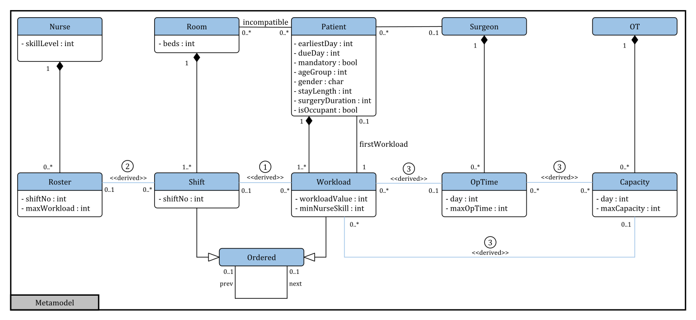
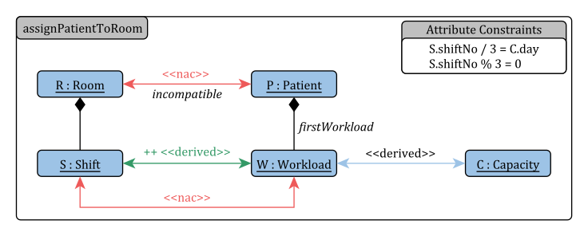
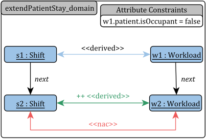
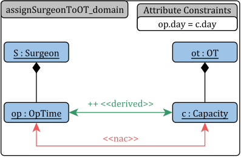
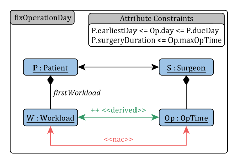
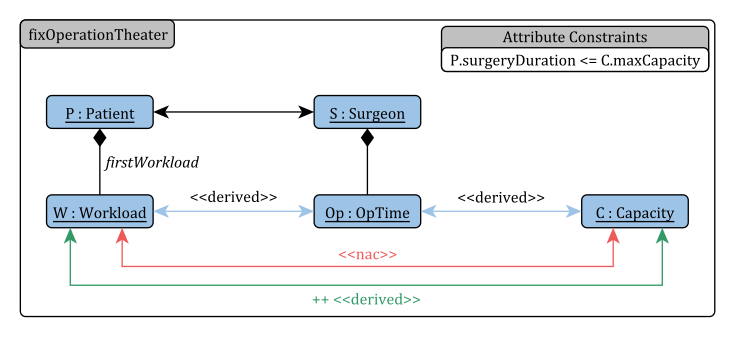

# Basic Modelling and Problem Description for the IHTP

This document refers to section 3 in the paper.
The basic modelling and problem description of the IHTP consists of three parts: The *metamodel*, *GT rules*, and *OCL constraints*.

## Metamodel

This section shows the metamodel specified in section 3.1 in the paper.

## GT Rules

This section contains all GT rules for section 3.2 in the paper.

## OCL Constraints

This section contains all OCL constraints for section 3.3. in the paper.

- The auxilary OCL definitions can be found in [auxilary.ocl](./ocl-constraints/auxilary.ocl).
- The hard constraints (H1 to H8) in OCL can be found in [hard.ocl](./ocl-constraints/hard.ocl).
- The additional necessary hard constraints in OCL can be found in [hard-additional.ocl](./ocl-constraints/hard-additional.ocl).
- The soft constraints (S1 to S8) in OCL can be found in [soft.ocl](./ocl-constraints/soft.ocl).
