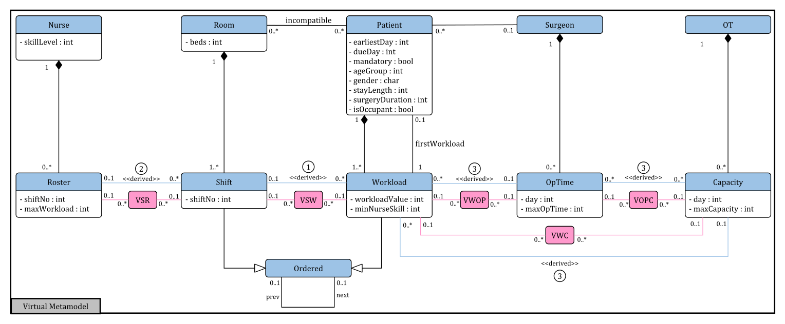

# Solution Description

This document refers to section 4 in the paper.
The solution description of the IHTP consists of three parts: The *adapted metamodel*, different sets of *GT rules*, a *GIPSL specification*.

## Adapted Metamodel

This section shows the adapted metamodel specified in section 4.1 in the paper.

## GT Rules

This section contains all GT rules for section 4 in the paper.

- Preprocessing GT rules (section 4.2) can be found in [preprocessing.gt](./gt-rules/preprocessing.gt).
- Postprocessing GT rules (section 4.4) can be found in [postprocessing.gt](./gt-rules/postprocessing.gt).
- GIPSL-/optimisation-related GT rules (section 4.3) can be found in [gipsl-gt-rules.gt](./gt-rules/gipsl-gt-rules.gt).

## GIPSL Specification

The complete GIPSL specification (including the optimisation-related GT rules, all hard constraints, and all soft constraints) can be found in the [GIPSL implementation project](../implementation/ihtcvirtualgipssolution/src/ihtcvirtualgipssolution/Model.gipsl).
